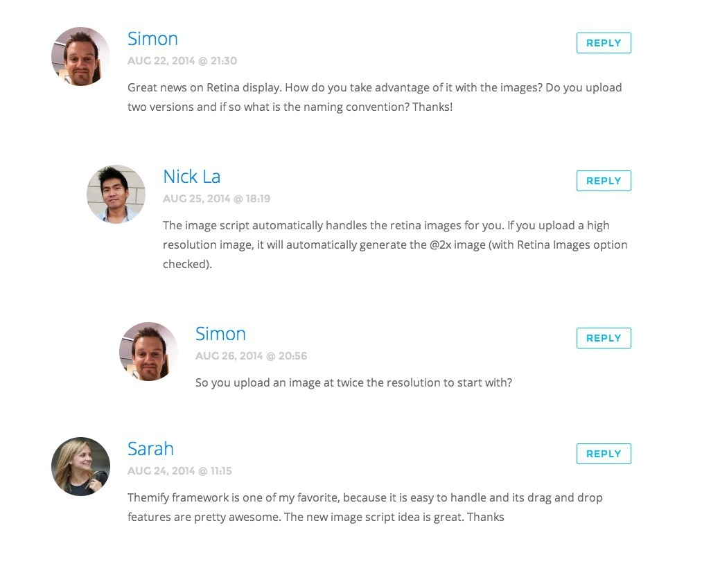
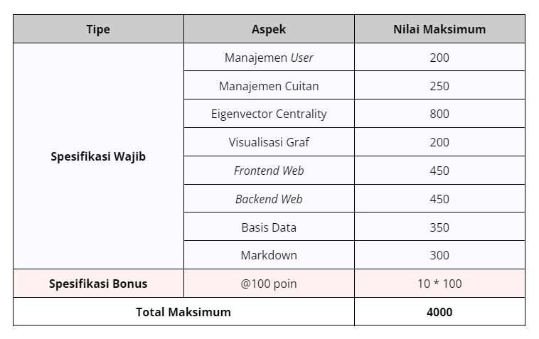

# Social Network Influencer Detector
> Task Seleksi Lab IRK created by Leon

versi **10 Juli 2024**

## 💡 Latar Belakang
Di era digital ini, media sosial telah menjadi wadah utama untuk komunikasi dan distribusi informasi. Tidak hanya sebagai platform interaksi sosial, media sosial juga menjadi medan pengaruh yang sangat kuat di mana individu atau kelompok dapat membentuk opini publik, tren, dan bahkan keputusan penting. Salah satu tantangan utama dalam memahami jaringan sosial adalah mengidentifikasi siapa yang benar-benar memiliki kekuatan pengaruh besar.

Dengan menggunakan konsep **Eigenvector Centrality**, Influencer Detector dibangun sebagai aplikasi yang bertujuan untuk menemukan individu yang memiliki pengaruh terbesar dalam sebuah jaringan sosial. Eigenvector Centrality tidak hanya mengukur seberapa terhubungnya suatu node, tetapi juga seberapa penting koneksi tersebut, sehingga memberikan gambaran yang lebih akurat tentang siapa yang benar-benar berpengaruh.

 
  <b>Fig 1.</b> Influencer dan Pengaruhnya bagi Sekitarnya.
 

 

**Mengapa penting?** Anda dapat dengan mudah mengetahui siapa yang bisa menggerakkan opini di jaringan Anda, atau bahkan memprediksi tren yang akan datang dengan mengamati mereka yang memiliki pengaruh terbesar. Dengan aplikasi ini, tidak hanya individu atau perusahaan dapat mengetahui siapa yang memegang kendali pengaruh di jaringan mereka, tetapi juga dapat merencanakan strategi komunikasi yang lebih efektif, mengidentifikasi potensi kolaborasi, dan memaksimalkan dampak kampanye mereka.

## 📝 Spesifikasi Tugas
Influencer Detector dibuat **berbasis website**. Bahasa dan *Framework* dibebaskan untuk *Frontend* dan *Backend Website*, tetapi Basis Data **wajib** diimplementasikan menggunakan SQL. Berikut adalah penjelasan detail dari spesifikasi yang wajib dimiliki Influencer Detector.

### Spesifikasi Wajib (3000 Poin)
#### 1. **Manajemen *User***

- *User* memiliki atribut minimal yaitu nama, jumlah *followers*, kapan pertama kali bergabung dengan aplikasi (tanggal), dan seluruh cuitan (*tweets*) yang pernah diberikan. Detail terkait cuitan dibahas pada poin [Manajemen Cuitan](#2-manajemen-cuitan-tweets).
- Aplikasi menyediakan fitur yang memungkinkan pengguna untuk melakukan manajemen *user*. Hal ini meliputi membuat *user* baru dan mengubah semua parameter yang terkait dengannya (jumlah *followers*, tanggal bergabung, dan cuitan).
- Manajemen pada poin sebelumnya dapat dilakukan dengan dua cara:
    - Dilakukan melalui aplikasi secara langsung, sediakan antarmuka untuk melakukan hal ini.
    - Dilakukan dengan mengunggah kumpulan data *user* secara *batch*, sehingga tidak perlu memasukkannya satu demi satu. Bentuk masukan yang diberikan adalah JSON dan struktur data yang digunakan **dibebaskan** kepada Anda. Sediakan antarmuka untuk melakukan hal ini.

#### 2. **Manajemen Cuitan (*Tweets*)**
- Cuitan memiliki atribut minimal yaitu nama pengguna yang memberikan cuitan, jumlah *likes*, jumlah *retweet*, dan cuitan lain yang menanggapi cuitan terkait jika ada.
- Seorang *user* dapat memiliki banyak cuitan berbeda.
- Cuitan dari seorang *user* bisa merupakan tanggapan untuk cuitan dari yang lain. 
   
    **Contoh** : 
    
    Cuitan dari *user* A merupakan cuitan yang menanggapi cuitan dari *user* B. 

    Selain itu cuitan bisa saja merupakan cuitan independen yang tidak ditujukan untuk menanggapi cuitan yang lain.
    
    **Contoh** : 
    
    Cuitan dari *user* A yang ditujukan untuk curhat.
- Berdasarkan poin sebelumnya, cuitan yang merupakan tanggapan untuk cuitan lain dan *retweet* **harus** berasal dari nama pengguna yang valid (berada pada tabel *User* di basis data).
- Manajemen cuitan dilakukan dengan mekanisme yang sama dengan manajemen *user*, bisa ditambahkan secara langsung melalui aplikasi maupun secara *batch* melalui unggah data dalam format JSON. Struktur data yang digunakan **dibebaskan**.
     

#### 3. **Perhitungan Eigenvector Centrality**
- Lakukan eksplorasi terkait konsep eigenvector centrality dan implementasikan pada aplikasi untuk menentukan nilai influensi (*influence rate*) dari seorang *user* berdasarkan data yang tersedia.
- Anda **dibebaskan** untuk menentukan faktor yang akan digunakan untuk menentukan nilai influensi dari seorang *user*. Contoh yang dapat Anda gunakan adalah jumlah *retweet* dalam `X` cuitan terakhir dengan `X` dibebaskan, atau jumlah *likes* terbanyak dari sebuah cuitan acak sejak akun pertama kali dibuat, atau parameter yang lain. 
- Semakin baik faktor influensi (*influence factor*) yang Anda ajukan akan membuat nilai influensi seorang *user* menjadi semakin representatif dan nilai Anda akan semakin tinggi. Anda dibebaskan untuk **menentukan 5 faktor influensi**.
- Selain faktor, Anda juga **dibebaskan** untuk menentukan bobot atau nilai kontribusi dari setiap faktor yang ditentukan untuk melakukan kalkulasi nilai influensi dari seorang *user*. Silakan lakukan serangkaian *tuning* dan pengujian hingga Anda menemukan nilai bobot yang Anda rasa paling tepat, semakin representatif, maka nilai Anda akan semakin tinggi.

#### 4. **Visualisasi Graf**
- Selain kalkulasi, Anda juga diminta untuk melakukan visualisasi graf influensi dari seorang *user* kepada *user* lainnya. Representasikan simpul sebagai *user* (Anda dapat menuliskan nama dari *user*), dan sisi sebagai relasi yang tercipta antar *user*.
- Implementasi **dibebaskan** menggunakan *framework* apapun.
- Berikan perbedaan antara *user* terhadap nilai influensinya, misalkan *user* dengan nilai influensi lebih tinggi memiliki ukuran simpul yang lebih besar, atau variasi warna, atau yang lainnya. Implementasinya **dibebaskan**, tetapi **wajib ada**.
- Visualisasi harus diimplementasikan secara dinamik dengan mempertimbangkan faktor-faktor berikut.
    - Perubahan data *user*, misalnya perubahan nama atau penambahan *user* baru sesuai dengan poin [Manajemen *User*](#1-manajemen-*user*) juga  **harus** ikut mengubah informasi pada graf yang ditampilkan secara otomatis.
    - Perubahan data pada faktor influensi yang telah ditentukan pada poin [Perhitungan Eigenvector Centrality](#3-perhitungan-eigenvector-centrality) juga **harus** ikut mengadaptasi komposisi pada graf, misalnya ukuran simpul, nilai, warna, relasi, atau yang lainnya.

#### 5. Ketentuan *Frontend* Website
- Seperti yang telah disampaikan di awal, bahasa dan *framework* yang digunakan untuk implementasi dibebaskan.
- Berikut adalah daftar halaman **minimal** yang perlu untuk diimplementasikan.
    - **Halaman Beranda (*Dashboard*)**
    Halaman ini berisi data 10 *user*s dengan nilai influensi paling tinggi. Pastikan bagian ini diperbaharui secara otomatis jika terjadi perubahan nilai influensi akibat perubahan nilai faktor influensi.
    - **Halaman Manajemen *User***
    Halaman ini berisi komponen yang digunakan untuk melakukan seluruh mekanisme manajemen *user* seperti yang dijelaskan pada poin [Manajemen *User*](#1-manajemen-*user*). 
    
        Pada halaman ini juga dapat ditampilkan data seluruh *user* yang terdaftar pada aplikasi, tetapi Anda boleh membuatnya pada halaman yang berbeda.

    - **Halaman Manajemen Cuitan (Tweets)**
    Halaman ini berisi komponen yang digunakan untuk melakukan seluruh mekanisme manajemen cuitan seperti yang dijelaskan pada poin [Manajemen Cuitan](#2-manajemen-cuitan-tweets).
    
        Pada halaman ini juga dapat ditampilkan data seluruh cuitan yang terdaftar pada aplikasi, tetapi Anda boleh membuatnya pada halaman yang berbeda. Berikut adalah salah satu inspirasi tampilan cuitan yang dibuat menjorok jika merupakan tanggapan dari cuitan lain.
         
        
        

            
             
                <b>Fig 2.</b> Referensi Tampilan Daftar Cuitan.
             
        

         

    - **Halaman Visualisasi Graf**
    Halaman ini akan berisi visualisasi graf hasil kalkulasi dengan [Eigenvector Centrality](#3-perhitungan-eigenvector-centrality) sesuai dengan poin [Visualisasi Graf](#4-visualisasi-graf). Bagian ini juga dapat disatukan dengan Halaman Beranda.
- Keindahan tampilan antarmuka (UI) dan pengalaman pengguna selama menggunakan antarmuka (UX) **menjadi bagian dari penilaian** (pembuat Task menyukai *Frontend*). Jadikan kesempatan ini bagi Anda untuk mempelajari *Frontend Web Development* jauh lebih baik lagi.
- Kembangkan sisi *Frontend* dengan arsitektur kode yang baik. Bagian ini tidak menjadi bagian dari penilaian, tetapi pastikan bahwa arsitektur kode yang dibangun mudah dibaca, bisa dikembangkan tanpa perlu banyak mengubah kode (*loosely coupled*), dan tetap menghasilkan tampilan yang menarik serta intuitif.

#### 6. Ketentuan *Backend Website*
- Seperti yang telah disampaikan di awal, bahasa dan *framework* yang digunakan untuk implementasi dibebaskan.
- Pengembangan *Backend* **harus** dilakukan dengan menggunakan gaya arsitektur *web service* RESTful API. 
- Kerapihan struktur kode dan arsitektur REST **menjadi bagian dari penilaian**. Jadikan kesempatan ini bagi Anda untuk mempelajari *Backend Web Development* jauh lebih baik lagi.
- Anda dibebaskan untuk menentukan *endpoint* apa saja yang akan digunakan dan bisa diakses oleh klien pengguna *web service*. Pastikan Anda memiliki *endpoint* yang cukup untuk menjalankan semua fungsionalitas aplikasi yang telah dijelaskan sebelumnya.

#### 7. Ketentuan Basis Data
- Seperti yang telah disampaikan di awal, basis data **wajib** diimplementasikan dengan SQL (MySQL, MariaDB, PostgreSQL, dan yang lainnya).
- Anda **dibebaskan** untuk merancang struktur basis data, mulai dari tabel-tabel yang diperlukan, batasan (*constraint*) yang perlu dijaga, hingga praktik basis data relasional kompleks seperti *indexing, views*, dan *triggers*. 
- Pastikan seluruh komponen basis data yang dibuat cukup untuk menjalankan semua fungsionalitas aplikasi.

#### 8. Ketentuan Markdown (README.md)
Berikut adalah hal-hal yang perlu disampaikan pada README.
- **Deskripsi aplikasi**, sampaikan secara jelas.
- **Teknologi, Bahasa, dan *Framework* yang digunakan**. Jika Anda memisahkan repositori *Frontend* dan *Backend*, maka jelaskan pada masing-masing repositori.
- **Struktur program**. Boleh dalam bentuk pohon (*tree*) atau yang lainnya.
- **[*Backend*] Komponen Algoritma**, diharuskan memuat komponen berikut.
    - Penjelasan Eigenvector Centrality.
    - Pengaplikasian konsep Eigenvector Centrality pada pembangunan Influencer Detector.
    - Sebutkan dan jelaskan faktor influensi yang digunakan.
    - Sebutkan dan jelaskan bobot yang digunakan.
    - Contoh kasus, proses kalkulasi yang dilakukan, dan hasil.
    - Analisis algoritma.
- **[*Frontend*] Komponen *Frontend Website***, diharuskan memuat komponen berikut.
    - Cara menjalankan program.
    - Daftar halaman yang dibuat dan kegunaannya.
    - Tangkapan layar setiap halaman yang dibuat.
- **[*Backend*] Komponen *Backend Website***, diharuskan memuat komponen berikut.
    - Cara menjalankan program.
    - Daftar seluruh *endpoint* yang dibuat, *method* yang digunakan, dan deskripsi singkat kegunaannya. Dapat pula menggunakan [swagger.io](http://swagger.io).
- **[*Backend*] Komponen Basis Data**, diharuskan memuat komponen berikut.
    - DBMS yang digunakan, pastikan SQL.
    - *Entity Relationship Diagram* (ERD) dari setiap entitas basis data.
    - Praktik basis data relasional kompleks (jika ada).
- **Referensi Belajar**.

### Spesifikasi Bonus (1000 Poin)
Selain spesifikasi wajib, juga terdapat spesifikasi bonus yang bisa Anda kerjakan. Pastikan Anda sudah mengerjakan seluruh [**Spesifikasi Wajib**](#spesifikasi-wajib-3000-poin) sebelum mengerjakan bagian ini. Mekanisme penilaian untuk bagian ini akan dilakukan dengan menggunakan **total dari poin bonus**. Anda hanya perlu untuk **mengumpulkan total 10 poin bonus** untuk mendapatkan nilai penuh pada bagian ini, lebih dari itu tetap akan dihitung sebagai total 10 poin bonus. Berikut adalah beberapa bonus yang bisa Anda kerjakan.

#### 1. Menampilkan Faktor Influensi [1 poin bonus]
Seorang *user* dapat memiliki nilai influensi yang tinggi karena terdapat nilai pada salah satu faktor influensi yang tinggi. Beri tahu pengguna aplikasi, faktor influensi yang paling berpengaruh bagi setiap *user* yang ada melalui tampilan antarmuka aplikasi. Anda dapat menampilkannya pada beranda dan simpul pada visualisasi graf. Mekanisme implementasi dibebaskan, pastikan tidak mengganggu tampilan dari komponen *Frontend Website* yang wajib untuk ditampilkan. Jelaskan proses implementasi dan lampirkan tangkapan layar hasil implementasinya pada README.md.

#### 2. Menambahkan Faktor Influensi [2 poin bonus]
Bagian ini merupakan pengembangan dari spesifikasi wajib pada poin [Perhitungan Eigenvector Centrality](#3-perhitungan-eigenvector-centrality). Pada spesifikasi bonus ini, Anda diminta untuk mengembangkan faktor influensi **lebih dari 5** (berapapun jumlahnya, asalkan lebih dari 5, akan masuk dalam spesifikasi bonus ini). Perlu diperhatikan bahwa penambahan faktor influensi tidak serta merta membuat hasilnya menjadi lebih baik dan representatif terhadap nilai influensi seorang *user*, sehingga pastikan bahwa penambahan faktor influensi yang Anda usulkan membuat hasilnya lebih baik (tidak perlu signifikan, tetapi tidak juga perubahan minimal). Jelaskan faktor yang ditambahkan serta lampirkan bukti yang menyatakan bahwa hasilnya lebih baik pada README.md.

#### 3. Implementasikan Algoritma Alternatif [1-4 poin bonus]
Dalam beberapa kasus, Eigenvector Centrality kurang mampu untuk melakukan kalkulasi nilai influensi dengan baik. Pada poin spesifikai bonus ini, Anda diminta untuk melakukan eksplorasi hingga mengimplementasikan **minimal 1** algoritma yang menjadi alternatif dari Eigenvector Centrality (berapapun jumlahnya akan masuk dalam spesifikasi bonus ini, tidak berlaku kelipatan). Poin spesifikasi ini **tidak menggantikan spesifikasi wajib** (sesuai namanya, alternatif), sehingga berikan pengguna aplikasi kesempatan untuk memilih algoritma yang ingin digunakan, bisa melalui *dropdown*, *toggle*, atau yang lain. Kualitas implementasi algoritma menentukan jumlah poin bonus yang didapat (rentang 1-4). Jelaskan hasil eksplorasi dan implementasi algoritma alternatif yang Anda lakukan pada README.md.

#### 4. Transaksi Basis Data [3 poin bonus]
Dalam menerima sebuah masukan dalam bentuk *batch* dengan format JSON, tidak menutup kemungkinan terjadi kegagalan di tengah-tengah proses memasukkan seluruh data, baik data pengguna maupun data cuitan, ke dalam basis data. Sebut saja terdapat 5 data *user* dalam masukan *batch* dan terjadi kegagalan saat memasukkan data dari *user* ke 3. Mekanisme yang umumnya dilakukan oleh program adalah melewati data tersebut sehingga data yang tercatat di basis data hanyalah 4 *user* (data *user* 3 dilewati). Akan tetapi, pada konteks yang lebih luas dan aplikasi yang lebih besar, hal ini tidak boleh untuk dilakukan karena menyebabkan inkonsistensi data. 

Pada poin bonus ini, Anda diminta untuk mengimplementasikan sebuah **mekanisme transaksional data**, sehingga ketika terdapat sebuah data yang gagal dieksekusi masuk ke dalam basis data, maka seluruh data yang berhasil dieksekusi sebelum terjadi kegagalan eksekusi **ikut digagalkan**. Dalam studi kasus yang dijelaskan sebelumnya, maka data *user* ke 1 dan 2 yang telah masuk ke basis data harus dikembalikan ke kondisi awal (*rollback*). Jelaskan bagaimana Anda mengimplementasikannya dan lampirkan buktinya pada README.md.

#### 5. Melakukan Deployment [max. 5 poin bonus]
Pastikan seluruh orang di dunia tahu Anda sedang membuat sebuah proyek yang keren! Untuk mengerjakan bonus ini, lakukan *deployment* pada *Frontend Website* (2 poin), *Backend Website* (2 poin), dan Basis data (1 poin) sehingga bisa diakses secara global. Jelaskan teknologi yang Anda gunakan untuk melakukan *deployment* dan lampirkan tautannya pada README.md.

#### 6. Gunakan *Real-world Data* [6 poin bonus]
Merasa kurang tertantang karena menggunakan data sintetis? Anda dapat mencoba melakukan pengujian aplikasi Anda dengan menggunakan **Twitter API**. Perlu untuk diperhatikan bahwa Anda mungkin perlu untuk mengubah faktor influensi berdasarkan data yang tersedia melalui public API yang diberikan dan harus menyimpan data *user* dan cuitan pada basis data. Jelaskan proses implementasi yang Anda lakukan dan perubahan yang dilakukan pada spesifikasi wajib (jika ada) pada README.md.

#### 7. Identifikasi Sentimen Influensi [7 poin bonus]
> [!WARNING]
> Don’t try this at home without high dedication and level kegabutan!

Tidak semua influensi merupakan hal yang baik. Oleh sebab itu, buatlah sebuah fitur tambahan untuk melakukan identifikasi apakah influensi yang diberikan merupakan influensi positif atau negatif. Implementasi **dibebaskan**, tetapi **harus dibangun sendiri**, tidak boleh menggunakan *library* bawaan. Anda dapat mencari data latih secara mandiri. Jelaskan proses implementasi yang Anda lakukan serta hasilnya pada README.md. 

## 📂 Pengerjaan dan Pengumpulan
1. Buatlah repositori **private** pada github masing-masing dan invite `mikeleo03` dalam repositori tersebut.
2. Berkas yang dikumpulkan berupa **link rilis tag ke repositori github** yang telah dibuat dengan ketentuan sebagai berikut.
    - Memberikan tag `vn` pada commit terakhir Anda setiap kali ingin melakukan submisi dengan `n` adalah jumlah submisi yang telah dilakukan. (contoh: `v1` untuk submisi pertama).
    - **Tidak menggunakan *url shortener*** (bit.ly, shortlink, atau yang lain) saat melakukan pengumpulan *task*.
    - Anda dapat melakukan rilis dengan panduan [berikut](https://docs.github.com/en/repositories/releasing-projects-on-github/managing-releases-in-a-repository).
3. **Lakukan submisi** pada [website seleksi IRK](https://seleksi-irk.vercel.app) dengan menggunakan akun std.stei.itb.ac.id, **lakukan konfirmasi** ke LINE `@leonmike_`, dan **jadwalkan demo** dengan cara yang sama. Lakukan hal yang sama jika membuat rilis yang baru.
4. Jika terdapat pertanyaan dapat menghubungi LINE `@leonmike_`.

## 📌 Penilaian

**Good Luck! it's not worth if you're not having fun**